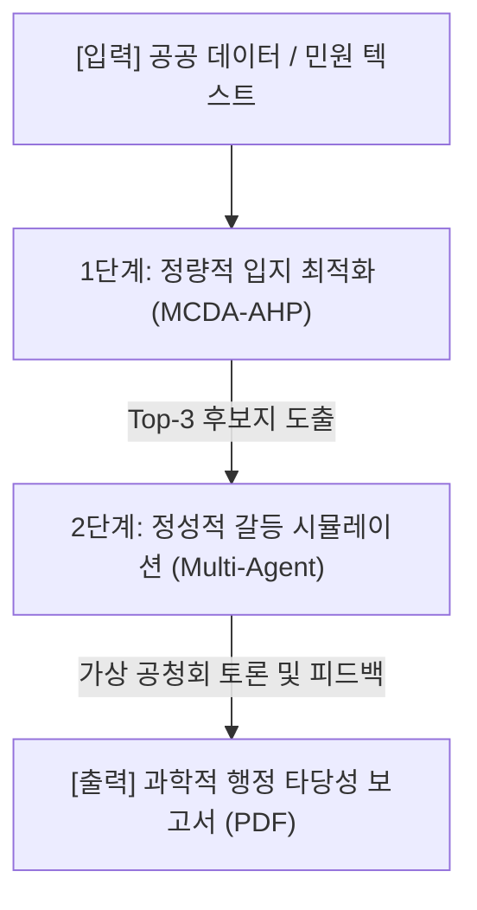

# 🏙️ 빅프로젝트 요약: SDSS 플랫폼

본 문서는 **"GIS 공간 빅데이터 및 Multi-Agent 시뮬레이션 기반 스마트 시티 실외 흡연구역 최적 입지 선정 및 정책 검증 플랫폼 (SDSS)"**의 핵심 기획, 기술 아키텍처, 리스크 방어 전략 및 로드맵을 통합 요약한 노트입니다.

더 상세한 내용은 원본 노트를 참고해 주세요. (연관 노트: [[빅프로젝트]])

---

## 1. 과제 개요 및 필요성
* **과제명**: 공간 빅데이터 및 Multi-Agent 시뮬레이션 기반 스마트 시티 실외 흡연구역 최적 입지 선정 및 정책 검증 플랫폼 (SDSS)
* **목적**: 흡연권과 혐연권 간의 사회적 갈등을 데이터 기반 과학행정으로 해결하고, 지자체의 오설치로 인한 중복 예산 매몰(부스당 2,000~3,000만 원)을 예방하는 의사결정 보조 시스템 구축.
* **주요 근거**:
  * 최근 5년간 간접흡연 민원 **51만 건** 돌파 (2020년 대비 2.4배 급증).
  * 지자체 민원 사실조사 착수율 급감 (**98.5% ➔ 54.5%**).
  * 실외 흡연 시 유해물질 확산 범위: 미풍 시 **최대 100m** (질질청-연세대 연구, 2022).

---

## 2. 2단계 의사결정 파이프라인 (2-Stage Pipeline)
정량 분석과 정성 분석을 연계한 하이브리드 아키텍처를 채택하고 있습니다.

1. **1단계 (정량)**: GIS 공간 데이터를 기반으로 법적 제한 구역을 Rule-based 필터링(100%)하고 유동인구, 민원 핫스팟 레이어를 융합하여 AHP 가중치 수치 도출.
2. **2단계 (정성)**: 1단계 후보지 데이터를 입력받아 가상 에이전트(시민대표, 도시계획관, 보건행정관) 간의 토론 시뮬레이션을 돌려 주민 수용성(NIMBY 예방) 스트레스 테스트 수행.

---

## 3. 클라우드 & 쿠버네티스 아키텍처 (MSA)
지자체 전용 행정망(망분리 온프레미스)에 원클릭으로 이식할 수 있도록 **도커 컨테이너**와 **쿠버네티스(Helm)** 기반 아키텍처를 설계했습니다.

* **Frontend Pod**: React + Nginx 기반 지도 인터페이스 시각화.
* **Backend API Pod**: FastAPI 기반 AHP 연산 및 API 서빙.
* **Celery Worker & Redis Pod**: 시간이 걸리는 Multi-Agent 시뮬레이션 태스크를 비동기로 백그라운드 처리하여 브라우저 타임아웃 방지.
* **PostGIS DB Pod**: 공간 빅데이터 저장 및 연산.
* **vLLM Inference Pod**: GPU 전용 노드 풀에서 Solar/Llama-3 sLLM 추론 서비스 제공.

---

## 4. 알고리즘 편향 리스크 (Alleyway Bias) 및 해결방안
단순 금연구역 필터링 및 민원 회피 조건만 가동하면 본능적으로 **외딴 사각지대(골목 안쪽 구석 등)**로 입지가 추천되는 편향이 발생합니다.

* **해결책 ① (보행 접근성 감쇄)**: 민원/인구 수요 핫스팟으로부터 **도보 1~2분(반경 50~100m)** 내에만 가산점을 주어 실효성 확보.
* **해결책 ② (도시 안전망 연동)**: 지자체 **관제 CCTV 버퍼 범위** 및 **가로등 조명 인프라** 내에 배치를 유도해 치안 불안 해결.
* **해결책 ③ (Multi-Agent 피드백)**: 2단계에서 [시민대표] 및 [도시치안관] 에이전트가 범죄 리스크를 지적할 경우 알고리즘이 자동으로 타 대안지를 재검색하도록 피드백 루프 작동.

---

## 5. 시장성 및 특허 경쟁력 (SWOT)
* **시장성**: 하드웨어 위주의 기존 시장(부스 설치 기술 등)과 달리, **입지 최적화 SW 및 정책 리스크 시뮬레이터**라는 독보적인 블루오션 공략.
* **특허 전략**: `GIS AHP 적합도 점수와 연동된 LLM Multi-Agent 기반 정책 리스크 시뮬레이션 방법 및 장치`로 BM 특허 출원 추진.
* **진입 장벽 돌파**: 헬름 패키징을 통해 지자체의 폐쇄적인 망분리 온프레미스 클러스터 환경에 오프라인 포터블 배포 가능.

---

## 📅 7주 개발 로드맵 및 MVP 범위
* **1주차**: 아키텍처 및 DB 스키마 설계
* **2주차**: 서울시 마포구 GIS 및 민원 데이터 지오코딩 및 전처리
* **3주차**: MCDA 알고리즘 및 LangChain Multi-Agent 토론 로직 구현
* **4~5주차**: FastAPI 백엔드 + Kakao Map GIS 프론트엔드 연동 및 비동기 Celery 큐 통합
* **6~7주차**: F1-Score/Hit Rate 성능 평가 및 원클릭 PDF 다운로드 기능 구현

---

## 🔗 연관 노트
* [[빅프로젝트]] - 원본 상세 기획안
* [[2026-06-30]] - 오늘 일일 노트 기록으로 이동
