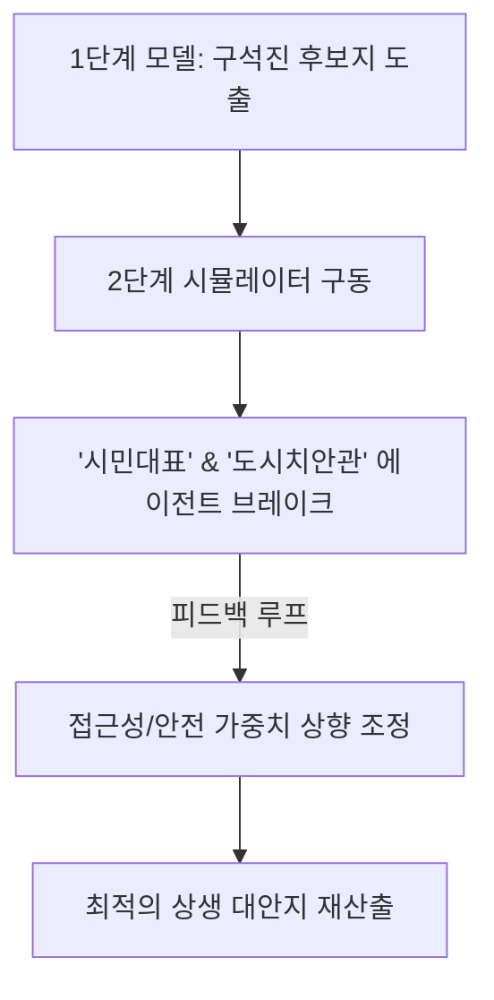

# 실외 흡연구역 입지 선정 편향(구석진 곳 매핑) 리스크 및 해결방안

본 문서는 **"스마트 시티 실외 흡연구역 최적 입지 선정 및 정책 검증 플랫폼 (SDSS)"** 실제 운영 시 발생할 수 있는 가장 대표적인 알고리즘 편향 리스크인 **"치안 사각지대 및 실효성 없는 구석진 위치만 선정되는 현상(Alleyway Bias)"**에 대한 원인 분석 및 기술적/정책적 해결방안을 정리한 보고서입니다.

---

## 1. 리스크 발생 원인 분석 (Why this happens?)

단순히 법적 규제(금연구역 버퍼 30m)와 민원 회피(주거지와의 거리 최대화)라는 **부정적 제약 조건(Negative Constraints)**만 고려할 경우, 알고리즘은 수학적으로 가장 민원이 없는 **도시의 외딴 사각지대(골목 구석, 방치된 공터 등)**를 최적지로 도출하게 됩니다.

이 경우 다음과 같은 심각한 실무적 문제가 발생합니다.
1.  **이용률 저하 (실효성 상실)**: 흡연자는 자신의 이동 동선에서 벗어나 5~10분 이상 걸어가야 하는 구석진 부스를 이용하지 않고, 원래 담배를 피우던 대로 대로변이나 상가 앞에서 무단 흡연을 계속합니다.
2.  **치안 및 청결 사각지대화 (NIMBY 심화)**: 사람들의 시선이 닿지 않는 구석진 곳에 설치된 부스는 청소년 비행, 불법 쓰레기 투기, 방화 리스크 등 도시 우범지대로 변질되어 인근 주민들의 극심한 반발을 재차 유발합니다.

---

## 2. 알고리즘적 해결방안 (Technical Mitigations)

이러한 편향을 방지하기 위해 1단계 정량적 입지 추천(MCDA-AHP) 모델에 **"긍정적 유틸리티 가중치(Positive Utility Weights)"**와 **"도시 인프라 연동 제약"**을 수식에 탑재합니다.

```
최종 입지 적합도 (S) = [정량적 가중치 연산] + [인프라 안전 점수] - [보행 접근성 감쇄 함수]
```

### ① 보행 접근성 감쇄 함수 (Accessibility Decay Function) 적용
*   실제 흡연 민원 발생 핫스팟(흡연 수요 발생지)으로부터 **도보 1~2분 이내(반경 50m~100m 이내)**의 공간에만 가산점을 부여합니다.
*   수요지로부터 거리가 너무 멀어지면 적합도 점수가 지수함수적으로 급감하게 설계하여, 흡연자가 실제로 걸어가서 피울 수 있는 '동선 내 최적지'를 유도합니다.

### ② 도시 안전 인프라 데이터 중첩 (Safety Data Overlay)
*   **CCTV 감시 범위(CCTV Buffer)**: 관제용 CCTV가 비추는 범위 내에 설치되도록 가산점을 부여하여 치안 불안을 선제적으로 예방합니다.
*   **스마트 가로등 및 조명 인프라**: 야간 통행량이 보장되고 가로등이 배치된 공유 부지만을 후보군으로 한정합니다.

### ③ 유동인구 임계값 설정 (Minimum Pedestrian Threshold)
*   일정 수준 이상의 상주 인구 및 유동인구가 보장되는 상업/오피스 활성화 구역 내의 '회색 지대(대로 바로 이면의 공용 공지 등)'를 탐색하도록 유동인구 하한선 임계값을 적용합니다.

---

## 3. Multi-Agent 2단계를 통한 정성적 보정 (Human-in-the-Loop)

1단계에서 기술적으로 걸러지지 않은 '구석진 곳'은 2단계 가상 공청회 시뮬레이션을 통해 정성적으로 걸러집니다.



*   **가상 에이전트의 피드백 루프**: 
    *   **[시민대표 에이전트]**: "해당 후보지는 야간에 너무 어둡고 인적이 드물어 주민들이 지나다닐 때 공포감을 느낍니다."
    *   **[도시치안관 에이전트]**: "CCTV 사각지대이며 골목 내부라 야간 청소년 비행 및 쓰레기 무단 투기 리스크가 80% 이상입니다."
*   이러한 토론 평가 점수가 임계치 이하로 떨어질 경우, 알고리즘은 해당 후보지를 제외하고 접근성과 안전성이 보장된 차순위 대안지를 재산출하도록 피드백 루프를 작동시킵니다.

---

## 4. B2G 사업화 관점의 소구점 (B2G Selling Point)

평가 위원들이 "실제 설치하면 이용률이 떨어지거나 탈선 장소가 될 것 같다"라고 공격할 때, 다음과 같이 명쾌하게 방어할 수 있습니다.

> **"저희 SDSS는 단순히 규제 구역만 피하는 소극적 알고리즘이 아닙니다. 흡연 수요 핫스팟으로부터의 도보 접근성 감쇄 모델과 지자체 CCTV/스마트 가로등 위치 데이터를 다기준 의사결정(AHP)에 중첩 반영하여, '흡연자가 이용하기 편리하면서도 도시 안전망 내에 노출된 상생형 부지'만을 과학적으로 도출하도록 설계되었습니다."**
