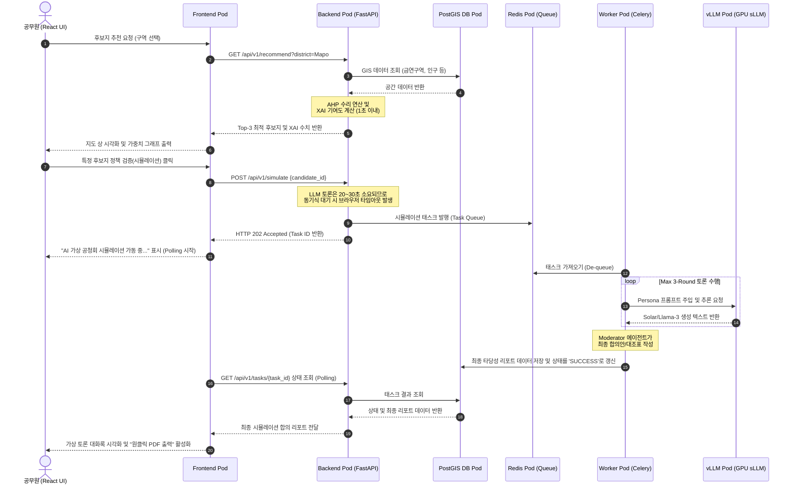

# 빅프로젝트 클라우드 및 쿠버네티스(Kubernetes) 아키텍처 설계안

본 문서는 **"스마트 시티 실외 흡연구역 최적 입지 선정 및 정책 검증 플랫폼 (SDSS)"** 서비스를 클라우드 환경 및 지자체 전용 행정망에 배포하기 위한 **도커 컨테이너(Docker Container) 및 쿠버네티스(Kubernetes) 기반의 엔터프라이즈 아키텍처 설계, 구체적인 구축 방법, 그리고 워크로드 흐름도**를 상세히 수립한 자료입니다.

---

## 1. 아키텍처 개요 (Containerized MSA)

본 플랫폼은 정량적 연산(GIS), 정성적 시뮬레이션(AI), 웹 프론트엔드가 분리된 **마이크로서비스 아키텍처(MSA)**를 지향하며, 클라우드 환경에서 유연하게 확장하기 위해 전체 시스템을 **컨테이너화(Docker)**하고 **쿠버네티스(Kubernetes)**로 오케스트레이션합니다.

```mermaid
graph TD
    subgraph 인터넷 / 공공 행정망
        User["공무원 (Web Client)"]
    end

    subgraph Kubernetes Cluster (NKS / EKS)
        Ingress["Kubernetes Ingress
        (Load Balancer & SSL)"] --> FE["Frontend Pod (React)"]
        Ingress --> BE["Backend API Pod (FastAPI)"]
        
        BE --> GIS["GIS Engine (PostgreSQL / PostGIS)"]
        BE --> Redis["Queue & Cache (Redis)"]
        BE --> Worker["Celery Worker Pod (Agent Loop)"]
        
        subgraph GPU Node Pool (AI Inference Serving)
            BE --> NER["NER Pod (KoBART-NER)
            [CPU/Light GPU]"]
            Worker --> vLLM["vLLM Model Server Pod (Solar / Llama-3 sLLM)
            [Heavy GPU / Triton or vLLM]"]
        end
    end
    
    vLLM --> PVC["Shared Storage (PVC)
    [Model Registry / RAG DB]"]
```

---

## 2. 프로세스 기준 워크로드 흐름 (Under the Hood: Pod-to-Pod Flow)

1단계(GIS-MCDA)와 2단계(Multi-Agent 시뮬레이션) 및 지오코딩 프로세스가 쿠버네티스 내의 각 **Pod(컨테이너 실행 단위)** 간에 어떻게 데이터와 메시지를 주고받는지에 대한 **이해 중심의 동작 흐름**입니다.



---

## 3. 단계별 실제 구축 방법 (Implementation Steps)

### [Step 1] 애플리케이션 컨테이너화 (Dockerizing)
각 마이크로서비스 컴포넌트를 독립적인 Docker 이미지로 빌드하기 위해 `Dockerfile`을 작성합니다.
*   **Frontend**: React 빌드 결과물을 경량 Nginx 컨테이너 위에 올려 정적 파일로 서빙합니다.
*   **Backend (FastAPI) & Celery Worker**: Python 의존성 패키지와 패키징하며, 동일한 소스 코드를 바탕으로 하되 실행 명령어를 분리(`uvicorn` vs `celery worker`)하여 각각 빌드합니다.
*   **PostGIS**: 공식 `postgis/postgis` 이미지를 확장하여 초기 공간 DB 덤프 데이터를 탑재합니다.

### [Step 2] vLLM GPU 추론 컨테이너 구축 (AI Serving)
*   Solar-10.7B 또는 Llama-3-8B 오픈소스 모델 가중치를 클라우드 공유 스토리지(NAS/PVC)에 다운로드합니다.
*   공식 vLLM Docker 이미지를 사용하여 GPU 컨테이너를 가동합니다.
    ```bash
    docker run --gpus all -v /shared/models:/models -p 8000:8000 vllm/vllm-openai:latest \
      --model /models/Solar-10.7B-Instruct --port 8000
    ```
*   vLLM은 OpenAI 호환 API를 제공하므로, Celery Worker 컨테이너는 OpenAI 클라이언트 라이브러리를 통해 이 포트(8000)로 신속히 추론 요청을 보낼 수 있습니다.

### [Step 3] 쿠버네티스 리소스 매니페스트(YAML) 작성
컨테이너들을 쿠버네티스 클러스터 상에 배포하기 위해 리소스 명세서를 정의합니다.
*   **Deployments & Pods**: 웹 서버(`frontend-deployment`), 백엔드(`backend-deployment`), 백그라운드 일꾼(`worker-deployment`), 추론 엔진(`vllm-deployment`)을 구성하여 Pod를 실행시킵니다.
*   **Tolerations & Node Selector**: 고가의 GPU 노드(Node Pool)를 보호하기 위해, `vllm-deployment` Pod만 GPU 노드에 할당되도록 **Tolerations(용인)**과 **Taints(장벽)**를 설정하고, 웹/WAS Pod는 저렴한 일반 CPU 노드 풀에 할당합니다.
*   **Services**: 외부 통신을 위해 `ClusterIP`(내부 통신용) 및 `Ingress`(외부 공무원 접속 관문)를 생성합니다.

### [Step 4] Helm Chart 기반 패키징 및 배포 자동화
*   작성된 모든 Kubernetes YAML 설정 파일들을 **Helm Chart** 구조로 패키징합니다.
*   이를 통해 네이버 클라우드(NCP CSAP 공공 존) 배포나 공공기관 내부망 온프레미스 서버 배포 시, 단 하나의 명령어로 전체 서비스를 배포할 수 있는 배포 파이프라인을 완성합니다.
    ```bash
    helm install sdss-platform ./sdss-helm-chart --namespace sdss-prod --create-namespace
    ```

---

## 4. Docker & Kubernetes 도입의 기술적 타당성

*   **B2G SaaS 멀티테넌시(Multitenancy) 대응**: 지자체별로 완전히 격리된 네임스페이스(Namespace)를 할당하여 리소스 간섭 없이 다수의 지자체 서비스를 안전하게 통합 가동합니다.
*   **지자체 보안망 통과 (망분리 포터블)**: 헬름 차트로 패키징된 배포 모델은 외부망 연동 없이 **내부 프라이빗 온프레미스 클러스터에 완전 오프라인 패키지로 이식할 수 있어** 공공기관 보안 규정을 우회·충족시키는 최고의 설계안이 됩니다.
