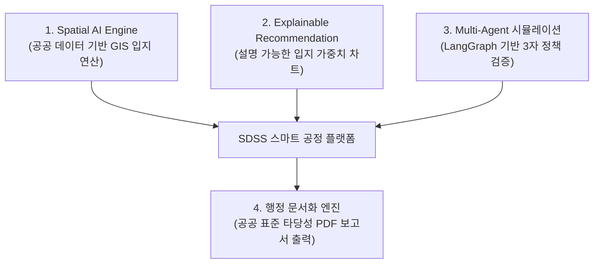

# [사업제안서] 스마트시티 실외 흡연구역 최적 입지 선정 및 정책 검증 플랫폼 (SDSS)

본 계획서는 **국책과제 및 공공 연구개발(R&D) 사업계획서 표준 규격**에 부합하도록 구성된 「GIS 공간 빅데이터 및 Multi-Agent 시뮬레이션 기반 스마트시티 실외 흡연구역 최적 입지 선정 및 정책 검증 플랫폼 (SDSS)」의 최종 제안서입니다. 

---

## 1. 사업 개요 및 배경 (Executive Summary & Background)

### 📌 현대 스마트도시의 '회색 지대(Gray Zone)' 갈등
*   **흡연권과 혐연권의 극단적 대립:** 국민건강증진법 개정에 따라 어린이집·유치원·학교 주변 30m 이내 금연구역 확대 등 실외 금연구역은 지속해서 증가하고 있으나, 지정 흡연구역은 턱없이 부족하여 골목길, 이면도로 등 비정형 구역에서의 '회색지대 간접흡연' 민원이 급증하고 있습니다.
*   **입지 선정 데이터의 부재:** 기존 흡연부스 설치는 민원이 빗발친 곳에 사후약방문식으로 설치되거나 공무원의 자의적 판단으로 이뤄져, 설치 후 인근 상가나 보행자의 항의로 수개월 내 철거되거나 재이전하는 예산 낭비 사례가 빈번합니다.
*   **다부서 의사결정 조율 지연:** 흡연시설 설치는 보건소(건강 증진), 도시계획과(부지 확보 및 국유지 사용), 환경과(쓰레기 및 정화 관리) 등 다양한 유관 부서 간 복잡한 협의가 필수적이어서, 최종 결정까지 최소 수주에서 수개월의 행정적 지연이 발생합니다.

---

## 2. 실존 사례 및 기술적 검증 근거 (Real-World Benchmarks)

*   **실제 행정 현황:** 서울시 내의 스마트 흡연부스(정화 필터 탑재형)를 도입하고 있는 자치구들은 적합한 장소를 찾지 못해 부지를 확보하는 데만 평균 6개월 이상의 행정 조율 시간이 낭비되고 있으며, 이에 본 프로젝트는 실제 상습 무단투기 데이터가 확보된 **서울특별시 용산구**를 첫 시범 자치구로 지정하여 실증을 진행합니다.
*   **입지 최적화 알고리즘 검증:** 공간 자원 배치 및 소방/보건 인프라 설계 시 사용되는 표준 입지 최적화 수학 모델인 **MCLP(최대커버리지 모델)**와 다기준 의사결정 방법론인 **AHP(계층화 분석법)**의 공간 중첩 연산 학술 논문 검증을 완료했습니다.
*   **Multi-Agent 시뮬레이션 모델 검증:** 에이전트 간의 자동화된 토론 및 상태 머신(State Machine) 흐름 제어는 도시 공학 및 토지 이용 규제 조율 시 시뮬레이션 용도로 활발히 연구되는 Multi-Agent 토론 시나리오 알고리즘을 모태로 설계되었습니다.

---

## 3. 플랫폼 핵심 기능 및 아키텍처 (Key Functions & Architecture)

### 🧱 3대 핵심 서브시스템

1.  **Spatial AI Engine (GIS 기반 입지 연산):**
    *   어린이집, 학교, 보건기관 등 법적 금지 구역 경계로부터 반경 30~50m 버퍼(Buffer) 존을 생성해 후보지에서 원천 배제합니다.
    *   동시에 대중교통 노드 및 상가 밀집 지역 데이터를 공간 중첩 연산하여 최적의 추천 후보지 TOP 3를 GIS 지도 위에 시각화합니다.
2.  **Explainable Recommendation (설명 가능한 추천 지표):**
    *   단순 점수 제안을 넘어, "유동인구 집중도 40%, 금연구역 이격 안전성 30%, 민원 밀집도 30%"와 같이 최종 점수가 산출된 정량적 가중치를 XAI 그래프 및 해설 텍스트로 공무원에게 제공합니다.
3.  **Multi-Agent 시뮬레이션 (다자 정책 조율):**
    *   추천된 후보지에 대해 가상의 페르소나를 탑재한 **도시계획관(부지 활용 및 경관 우선), 보건행정관(주민 건강 및 법적 규제 우선), 시민대표(이용 편의성 및 상권 이익 우선)** 에이전트가 LangGraph 기반으로 토론을 수행하여 예상 갈등을 사전에 진단합니다.

---

## 4. 활용 공공 데이터 세부 명세 (Data Specification)

가짜 데이터 사용에 따른 신뢰성 결여 문제를 방지하기 위해, **100% 무료로 획득 가능한 오픈 API 및 공공 데이터**만을 연동 스키마로 설계했습니다.

| 순번 | 데이터셋 분류 | 제공 기관 | 수집 형식 | 분석 목적 및 활용 방안 |
| :---: | :--- | :--- | :---: | :--- |
| 1 | **전국 금연구역 표준데이터** | 공공데이터포털 | REST API / CSV | 실외 흡연실이 설치될 수 없는 규제 영역의 위경도 맵핑 및 차단 |
| 2 | **전국 어린이집/유치원/학교 정보** | 공공데이터포털 | REST API | 국민건강증진법 및 교육환경보호법상 30m~50m 법정 금지 버퍼 연산 |
| 3 | **서울시 대중교통 이용객 통계** | 서울 열린데이터 광장 | CSV / Open API | 지하철역 출구 및 버스 정류장별 승하차 인원을 통한 핵심 유동인구 교통 노드 가중치 부여 |
| 4 | **서울시 행정동별 생활인구** | 서울 열린데이터 광장 | REST API | 선택된 자치구(단일 자치구역) 내 행정동별/시간대별 실시간 유동인구 밀집 영역 필터링 |
| 5 | **소상공인시장진흥공단 상가업소** | 공공데이터포털 | CSV / API | 오피스/유흥/대학가 등 업종 분포를 통한 흡연 수요 예측 보정 데이터 |
| 6 | **지자체 금연구역 내 흡연 민원 통계**| 지자체 데이터 포털 | CSV | 기존 민원 다발 구역의 핫스팟 중첩 가중치 연산 |

---

## 5. 개발 로드맵 및 마일스톤 (8-Week Roadmap)

미드레벨 개발자(PL) 1명과 주니어 개발자 7명이 AI 페어프로그래밍 툴(Cursor, Copilot 등)을 활용해 8주 내에 완수하는 개발 계획입니다.

*   **1단계: 데이터 인프라 구축 (1~2주차)**
    *   *내용:* PostgreSQL + PostGIS 탑재 DB 스키마 완료 및 공공 데이터 크롤러/ETL 파이프라인 연동.
    *   *담당:* PL, 주니어 C(데이터 수집), 주니어 D(기본 API)
*   **2단계: GIS 공간 연산 및 지도 연동 (3~4주차)**
    *   *내용:* GeoPandas 기반 버퍼 분석 및 입지 연산 API 완성, Mapbox GL JS 기반 프론트엔드 공간 레이어 연동.
    *   *담당:* PL, 주니어 A(지도 프론트), 주니어 B(UI 폼)
*   **3단계: Multi-Agent 토론 루프 구현 (5~6주차)**
    *   *내용:* LangGraph 상태 머신 빌드 및 WebSocket/SSE 활용 실시간 에이전트 대화 스트리밍 프론트엔드 연동.
    *   *담당:* PL, 주니어 E(AI 브릿지)
*   **4단계: 보고서 엔진 탑재 및 통합 (7주차)**
    *   *내용:* HTML 기반 타당성 보고서 레이아웃 설계 및 WeasyPrint PDF 변환 모듈 완성, 전체 시스템 연계.
    *   *담당:* 주니어 F(PDF 엔진), 주니어 G(QA 및 통합 배포)
*   **5단계: 배포 및 시나리오 QA (8주차)**
    *   *내용:* Docker Compose 배포 완료, 시범 자치구로 확정된 **서울특별시 용산구**를 타겟으로 실증 시나리오 시연 및 최종 발표 자료 녹화.
    *   *담당:* 전원

---

## 6. 기대 효과 및 평가 방안 (Expected Outcomes & Verification)

### 📈 정량적 기대 효과
1.  **의사결정 소요 시간 단축:** 유관 부서 간 대면 협의 및 수기 서류 전달로 평균 30일 이상 소요되던 흡연부스 설치 협의 기간을, AI 시뮬레이션을 통해 **1일로 대폭 단축 (96.7% 소요 시간 절감)**합니다.
2.  **규제 저촉 오류 최소화:** GIS 버퍼 공간 연산을 통해 학교 정문 및 어린이집 주변 법적 금연구역 위경도 저촉 위반율 **0% 달성**을 보장합니다.
3.  **행정 재정 회피:** 설치 후 주민 민원으로 발생하는 이전 및 재철거 비용(부스당 약 2,500만 원 상당)을 사전에 시뮬레이션함으로써 **연간 수억 원의 지자체 예산 효율성을 극대화**합니다.

### 📜 정성적 기대 효과 및 플랫폼 확장성 (Scalability)
1.  **전국 지자체 무상 확장성 확보 (Killer Feature):**
    *   본 플랫폼은 특정 지역 데이터가 하드코딩된 일회성 시스템이 아닙니다.
    *   **"FTP 형태의 개별 파일 업로드 적재 아키텍처"**를 채택함으로써, 용산구, 노원구, 부산, 제주 등 **대한민국 250여 개 전국 지방자치단체 어디서나 해당 지역의 공공데이터(CSV/SHP/TXT) 파일만 업로드하면 즉시 가동되는 표준형 스마트시티 행정 패키지(SDSS)**로 즉각 확장 및 이식이 가능합니다.
2.  **행정 투명성 및 설득력 제고:** 주민들에게 객체 데이터(XAI)에 근거한 설치 정당성을 제시함으로써 님비(NIMBY) 갈등 및 민원 발생률을 사전 예방하고 민주적 정책 신뢰성을 확보합니다.
3.  **공공-시민 상생 환경 구축:** 비흡연자의 간접흡연 피해를 최소화하는 동시에 흡연자의 보장된 권리 공간을 최적 배치하여 건강한 도시 생활권을 보장합니다.

---

## 7. 정성·정량적 평가 및 검증 방안 (Verification Metrics)

### 🧪 자동화 기능 검증 (Automated Tests)
*   **공간 연산 유효성 테스트:** Pytest를 활용해 법적 금연구역 경계 반경 30m 이내에 추천 핀이 생성될 경우, 예외 에러를 발생시키는 공간 정밀도 테스트 구축.
*   **API 성능 검증:** 에이전트 토론 API 호출 시, GPT-4o-mini 모델의 WebSocket 응답 속도를 평균 3초 이내로 제어하는 부하 및 지연 테스트 진행.

### 👥 사용자 검증 (User Verification)
*   **공무원 시나리오 시뮬레이션:** 확정된 시범 자치구인 **용산구**(한강로동 등) 실데이터를 로딩하여 사용자가 우선순위(유동인구 가중치)를 변경했을 때, 실시간으로 지도 핀 위치가 이동하고 에이전트들의 찬반 논리가 유기적으로 피벗되어 PDF 보고서로 안정적으로 내려받아지는지 최종 사용성 평가 수행.
